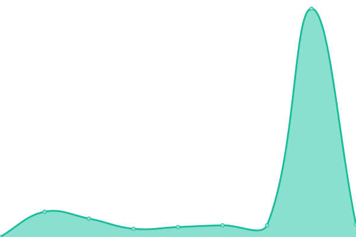

# [📈 Live Status](https://uptime.yasir.eu.org): <!--live status--> **🟧 Partial outage**

This repository contains the open-source uptime monitor and status page for [YasirArisM](https://yasirpedia.eu.org), powered by [Upptime](https://github.com/upptime/upptime).

With [Upptime](https://upptime.js.org), you can get your own unlimited and free uptime monitor and status page, powered entirely by a GitHub repository. We use [Issues](https://github.com/YasirArisM/Uptime/issues) as incident reports, [Actions](https://github.com/YasirArisM/Uptime/actions) as uptime monitors, and [Pages](https://uptime.yasir.eu.org) for the status page.

<!--start: status pages-->
<!-- This summary is generated by Upptime (https://github.com/upptime/upptime) -->
<!-- Do not edit this manually, your changes will be overwritten -->
<!-- prettier-ignore -->
| URL | Status | History | Response Time | Uptime |
| --- | ------ | ------- | ------------- | ------ |
|  [YasirPedia API](https://yasirapi.eu.org) | 🟩 Up | [yasir-pedia-api.yml](https://github.com/yasirarism/uptime/commits/HEAD/history/yasir-pedia-api.yml) | 

 524ms
     
 | 

<a href="https://uptime.yasir.eu.org/history/yasir-pedia-api">100.00%</a>
    

|  [Yasir RoBot](https://tg.yasirweb.biz.id) | 🟥 Down | [yasir-ro-bot.yml](https://github.com/yasirarism/uptime/commits/HEAD/history/yasir-ro-bot.yml) | 

 0ms
     
 | 

<a href="https://uptime.yasir.eu.org/history/yasir-ro-bot">100.00%</a>
    

|  [Torrent API](https://tor.yasirapi.eu.org) | 🟥 Down | [torrent-api.yml](https://github.com/yasirarism/uptime/commits/HEAD/history/torrent-api.yml) | 

 8840ms
     
 | 

<a href="https://uptime.yasir.eu.org/history/torrent-api">100.00%</a>
    

|  [Webss API](https://webss.yasirapi.eu.org) | 🟥 Down | [webss-api.yml](https://github.com/yasirarism/uptime/commits/HEAD/history/webss-api.yml) | 

 321ms
     
 | 

<a href="https://uptime.yasir.eu.org/history/webss-api">100.00%</a>
    

|  [URL Shortener](http://url.yasirweb.eu.org) | 🟥 Down | [url-shortener.yml](https://github.com/yasirarism/uptime/commits/HEAD/history/url-shortener.yml) | 

 340ms
     
 | 

<a href="https://uptime.yasir.eu.org/history/url-shortener">100.00%</a>
    

|  [Paste API](https://paste.yasirapi.eu.org/) | 🟩 Up | [paste-api.yml](https://github.com/yasirarism/uptime/commits/HEAD/history/paste-api.yml) | 

 676ms
     
 | 

<a href="https://uptime.yasir.eu.org/history/paste-api">100.00%</a>
    

|  [Personal Blog](https://yasirweb.eu.org) | 🟩 Up | [personal-blog.yml](https://github.com/yasirarism/uptime/commits/HEAD/history/personal-blog.yml) | 

 1117ms
     
 | 

<a href="https://uptime.yasir.eu.org/history/personal-blog">100.00%</a>
    

|  [Landing Page](https://yasirpedia.eu.org) | 🟩 Up | [landing-page.yml](https://github.com/yasirarism/uptime/commits/HEAD/history/landing-page.yml) | 

 391ms
     
 | 

<a href="https://uptime.yasir.eu.org/history/landing-page">100.00%</a>
    

|  [Subscene Mirror](https://sub.yasirweb.eu.org) | 🟩 Up | [subscene-mirror.yml](https://github.com/yasirarism/uptime/commits/HEAD/history/subscene-mirror.yml) | 

 537ms
     
 | 

<a href="https://uptime.yasir.eu.org/history/subscene-mirror">100.00%</a>
    

|  [Git Server](https://git.yasirweb.eu.org) | 🟩 Up | [git-server.yml](https://github.com/yasirarism/uptime/commits/HEAD/history/git-server.yml) | 

 608ms
     
 | 

<a href="https://uptime.yasir.eu.org/history/git-server">100.00%</a>
    

<!--end: status pages-->

[**Visit our status website →**](https://uptime.yasir.eu.org)

## 📄 License

- Powered by: [Upptime](https://github.com/upptime/upptime)
- Code: [MIT](./LICENSE) © [YasirArisM](https://yasirpedia.eu.org)
- Data in the `./history` directory: [Open Database License](https://opendatacommons.org/licenses/odbl/1-0/)
